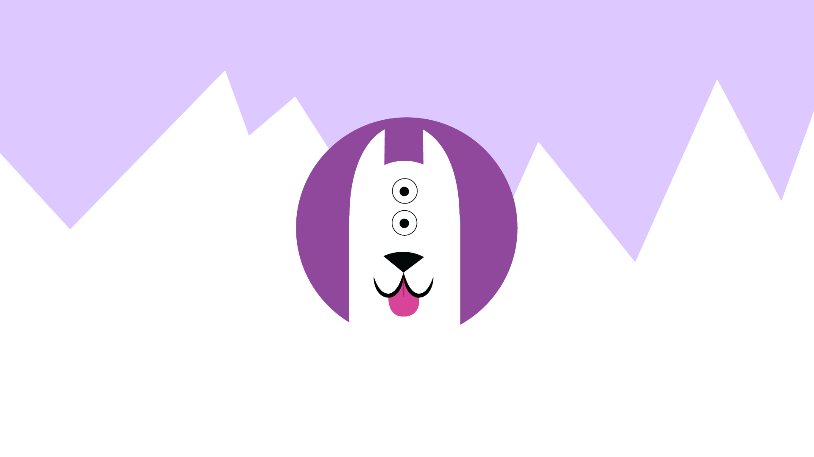

<!--
**ViLinh27/ViLinh27** is a ✨ _special_ ✨ repository because its `README.md` (this file) appears on your GitHub profile.

Here are some ideas to get you started:

- 🔭 I’m currently working on ...
- 🌱 I’m currently learning ...
- 👯 I’m looking to collaborate on ...
- 🤔 I’m looking for help with ...
- 💬 Ask me about ...
- 📫 How to reach me: ...
- 😄 Pronouns: ...
- ⚡ Fun fact: ...

-- tutorial from :https://www.sitepoint.com/github-profile-readme/
-->

  
  

    
    
    
    
  

  
  
  <h1>
    Hello!
    
  </h1>

  

---

### :woman_technologist: About Me :
:wave: I am a frontend web developer from Canada, based in the United States.

- :smile: Pronouns: She/ Her / Hers
- :telescope: I'm a recent graduate in Computer Science and software engineering. I hope to work in building web applications using my technical and visual skills.
- :seedling: Exploring Software Engineering and UX.
- :zap: In my free time, I make web applications and illustrate.
- :mailbox:How to reach me: 
- :art: See more of my projects: [My portfolio website](vilinh27.github.io)
---

### :hammer_and_wrench: Languages and Tools :

  &nbsp;
  &nbsp;
  &nbsp;
  &nbsp;
  &nbsp;
  &nbsp;
  &nbsp;
  &nbsp;
  

---

### :fire: My Stats :

### 30NitesOfCode:
  [Check out my progress!](https://www.codedex.io/@vilinh2778616/30-nites-of-code)  
  

